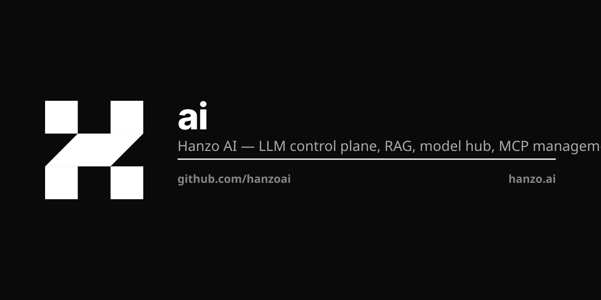

<p align="center"></p>

# ai

**The AI control plane for the Open AI Cloud** — model hub, native Go routing, and RAG in one binary.

[](https://github.com/hanzoai/ai/actions/workflows/build.yml)
[](https://github.com/hanzoai/ai/releases/latest)
[](https://github.com/hanzoai/ai/pkgs/container/ai)
[](https://github.com/hanzoai/ai/blob/main/LICENSE)
[](https://discord.gg/5rPsrAzK7S)

Forked from [Casibase](https://github.com/casibase/casibase) (Apache-2.0).

## What this is

`ai` is the canonical AI control plane for the Hanzo platform — model routing, RAG, model hub, and MCP management, implemented in pure Go. It speaks the OpenAI-compatible `/v1` API (`/v1/chat/completions`, `/v1/models`), routes 66+ models straight to upstream providers, and meters every request. Three auth modes (IAM API key `hk-*`, JWT, provider key `sk-*`). KMS-resolved provider secrets, org-scoped. Per-request usage tracking, fire-and-forget to IAM.

Renamed from `hanzoai/cloud` on 2026-05-19 when the unified binary took the `cloud` name (HIP-0106); `ai` now mounts as the `ai` subsystem inside [hanzoai/cloud](https://github.com/hanzoai/cloud).

Implements **HIP-0037** (AI Cloud Platform) and **HIP-0106** (Unified Cloud Binary — `ai` subsystem).

## Quick start

Call the hosted control plane:

```bash
curl -H "Authorization: Bearer hk-YOUR-API-KEY" \
  https://api.hanzo.ai/v1/chat/completions \
  -d '{"model":"zen4-pro","messages":[{"role":"user","content":"Hello"}]}'
```

Run it yourself (pin a released `vX.Y.Z` — never `:latest`):

```bash
docker pull ghcr.io/hanzoai/ai:vX.Y.Z
docker run -p 8000:8000 ghcr.io/hanzoai/ai:vX.Y.Z
```

Build from source:

```bash
CGO_ENABLED=0 GOOS=linux GOARCH=amd64 go build -ldflags="-w -s" -o cloud-api-server .
./cloud-api-server
```

## Architecture

`ai` implements **ZAP (Zero-overhead API Protocol)** — a native Go routing layer that connects callers directly to upstream providers with zero unnecessary hops (see [ZAP.md](ZAP.md)).

```
   user / api key  ->  hanzoai/gateway  ->  hanzoai/ai (Go)
                                                  |
                              auth: hk-* | JWT | sk-*
                                                  |
                              model routing: 66+ models -> upstream providers
                                                  |
                          +--------+--------+--------+--------+
                          |        |        |        |        |
                       DO-AI  Fireworks  OpenAI   Anthropic   ...
                          |        |        |        |        |
                              KMS-resolved provider secrets
                                                  |
                              IAM usage tracking (async)
```

| Component | Role | Home |
|-----------|------|------|
| **Router** | Native Go model routing, auth, billing, usage | this repo |
| **Frontend** | Admin UI, chat, knowledge base (React + Ant Design) | `web/` |
| **IAM** | Identity, API keys (`hk-`), usage tracking | [hanzoai/iam](https://github.com/hanzoai/iam) |
| **KMS** | Multi-tenant secrets, org-scoped projects | [hanzoai/kms](https://github.com/hanzoai/kms) |
| **Engine** | Local inference (Rust) | [hanzoai/engine](https://github.com/hanzoai/engine) |

### ZAP path

- **`/v1` API** — JSON over HTTP (`/v1/chat/completions`, `/v1/models`)
- **Three auth modes** — IAM API key (`hk-*`), JWT (hanzo.id OAuth), provider key (`sk-*`)
- **Static model routing** — 66+ models mapped to upstream providers in pure Go
- **Per-request usage** — async fire-and-forget to IAM
- **KMS-resolved secrets** — provider keys from Hanzo KMS, org-scoped
- **RAG** — one unified retrieval surface (hybrid keyword + vector) across every tenant index

## Supported models

| Tier | Provider | Count | Examples |
|------|----------|-------|----------|
| Free | DO-AI | 28 | `gpt-4o`, `gpt-5`, `o3`, `qwen3-32b`, `deepseek-r1-distill-70b`, `llama-3.3-70b` |
| Premium | Fireworks | 17 | `fireworks/deepseek-r1`, `fireworks/kimi-k2`, `fireworks/qwen3-coder-480b` |
| Premium | OpenAI Direct | 5 | `openai-direct/gpt-5`, `openai-direct/o3`, `openai-direct/gpt-4o-mini` |
| Premium (Zen) | Hanzo | 8 | `zen4-mini`, `zen4-pro`, `zen4-max`, `zen4-ultra`, `zen4-coder-pro`, `zen-vl`, `zen3-omni` |

Zen models are Hanzo's own family — `owned_by: hanzo`, premium. Full list: `GET /v1/models` (requires a valid Bearer token).

## Auto-routing (`auto` / `zen-router`)

Opt-in virtual model that picks the best concrete model per request. Send
`"model": "auto"` (alias `"zen-router"`) and the request is classified into a
coarse task (code, reasoning, math, creative, vision, long-context, cheap-chat,
general) and mapped to the first **servable** model in the matching preference
list — *before* provider, pricing, and billing resolution. So an `auto` request
is billed and reported as exactly the model that served it.

Enable it in `conf/models.yaml` (the `cloud-api-models` ConfigMap in prod), or
via env `ROUTER_ENABLED=true` / `ROUTER_ENDPOINT=<url>`:

```yaml
router:
  enabled: true
  endpoint: ""          # optional zen-router URL (see below); "" = built-in heuristic
  cost_ceiling: 0.0
  prefer:
    code:       [zen4-coder, zen5-coder, qwen3-coder, gpt-5.3-codex]
    reasoning:  [zen4-thinking, deepseek-reasoner, zen4-ultra]
    cheap_chat: [zen4-mini, zen5-mini, gpt-4o-mini]
    default:    [zen4, zen5, gpt-4o]
```

```bash
curl -H "Authorization: Bearer hk-YOUR-API-KEY" \
  -H "X-Max-Cost: 2.0" -H "X-Max-Latency-Ms: 800" \
  https://api.hanzo.ai/v1/chat/completions \
  -d '{"model":"auto","messages":[{"role":"user","content":"refactor this function"}]}'
# -> response header:  X-Routed-Model: zen4-coder
# -> response body:    {"model":"zen4-coder", ...}
```

### Per-org enable/disable

Routing can be overridden per org via the admin `OrgSettings` surface
(`/v1/*-org-settings`, global-admin-gated like `/v1/*-model-route`). An org row
carries `autoRouting`: `""` (unset), `"enabled"`, or `"disabled"`. It blends with
the global `router.enabled` flag as follows (`AutoRoutingActive`):

| global `router.enabled` | org `""` (unset) | org `"enabled"` | org `"disabled"` |
|-------------------------|------------------|-----------------|------------------|
| **true**                | route            | route           | **off** (no rewrite, no header) |
| **false**               | off              | route¹          | off              |

¹ Per-org opt-in routes even when the global flag is off, but ONLY when router
config is present (a `prefer` table or an `endpoint`) — otherwise there is nothing
to route with and `auto` is left unchanged.

- **Transparency** — the `X-Routed-Model` response header (and the `model` field
  in the body) report the model that served the request.
- **SLO** (optional) — `X-Max-Cost` (per-1k, float) and `X-Max-Latency-Ms` (int)
  headers express a per-request budget, forwarded to the engine strategy.
- **Two strategies** — with `endpoint` set, `ai` POSTs `{prompt, tasks?, slo}` to
  `{endpoint}/route` and uses its `{model, task, confidence}` reply — a learned
  **zen-router** ([huggingface.co/zenlm/zen-router](https://huggingface.co/zenlm/zen-router))
  served over `/v1` by [hanzo-engine](https://github.com/hanzoai/engine).
  On **any** error (or with no endpoint) it falls back to a built-in pure-Go
  heuristic, so `auto` works with **zero extra infrastructure**. The learned
  zen-router is the quality upgrade over the heuristic — same interface, better
  routing.

## Configuration

Set via `conf/app.conf` or environment variables:

| Variable | Description |
|----------|-------------|
| `HANZO_API_KEY` | Unified service token for internal IAM + KMS operations (billing/usage/auth) |
| `iamEndpoint` | IAM service URL (prod: `http://iam.hanzo.svc.cluster.local:8000`) |
| `clientId` / `clientSecret` | IAM OAuth client credentials for `ai` |
| `dataSourceName` | Database DSN (do not commit; inject via KMS-managed secret) |
| `KMS_CLIENT_ID` / `KMS_CLIENT_SECRET` | KMS Universal Auth credentials |
| `KMS_PROJECT_ID` | Default KMS project ID |
| `KMS_ENVIRONMENT` | KMS environment (default: `production`) |

## Deploy

```bash
# Kubernetes (production)
kubectl apply -f k8s/kms-secrets.yaml
kubectl apply -f k8s/configmap.yaml
kubectl apply -f k8s/deployment.yaml
kubectl apply -f k8s/service.yaml
```

The production deploy workflow (`.github/workflows`) resolves credentials from Hanzo KMS. Preferred setup is a single GitHub secret, `HANZO_API_KEY`; Universal Auth (`KMS_CLIENT_ID` + `KMS_CLIENT_SECRET`) remains a fallback.

> **Note** — `ai` runs single-replica: its balance ledger is an in-pod invariant. Deploy `strategy: Recreate` with `min=max=1` (a boot assertion panics if `CLOUD_API_REPLICAS > 1`). See [LLM.md](LLM.md) for the scale-out path.

## Development

```bash
# Backend
go build -race -ldflags "-extldflags '-static'"   # build
go test -v $(go list ./...) -tags skipCi           # test (requires MySQL)
golangci-lint run                                  # lint

# Frontend (web/)
cd web && yarn install && yarn start               # dev server
```

More detail for AI agents and contributors lives in [LLM.md](LLM.md).

## License

[Apache-2.0](https://github.com/hanzoai/ai/blob/main/LICENSE)

## Hanzo — the Open AI Cloud

Open source · every language · on-chain settlement. [hanzo.ai](https://hanzo.ai) · [docs.hanzo.ai](https://docs.hanzo.ai)

**SDKs in every language** — [Python](https://github.com/hanzoai/python-sdk) (flagship) · [TypeScript](https://github.com/hanzo-js/sdk) · [Go](https://github.com/hanzo-go/sdk) · [Rust](https://github.com/hanzo-rs/sdk) · [C++](https://github.com/hanzo-cpp/sdk) · [Swift](https://github.com/hanzo-swift/sdk) · [Kotlin](https://github.com/hanzo-kt/sdk) · [umbrella](https://github.com/hanzoai/sdk)
